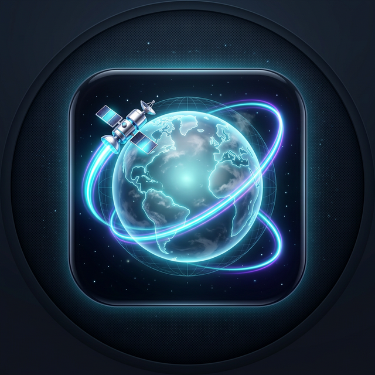
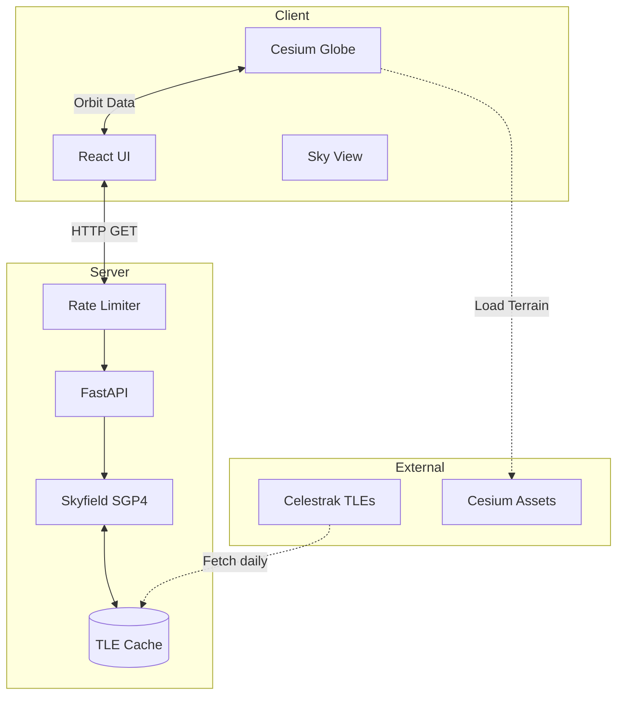
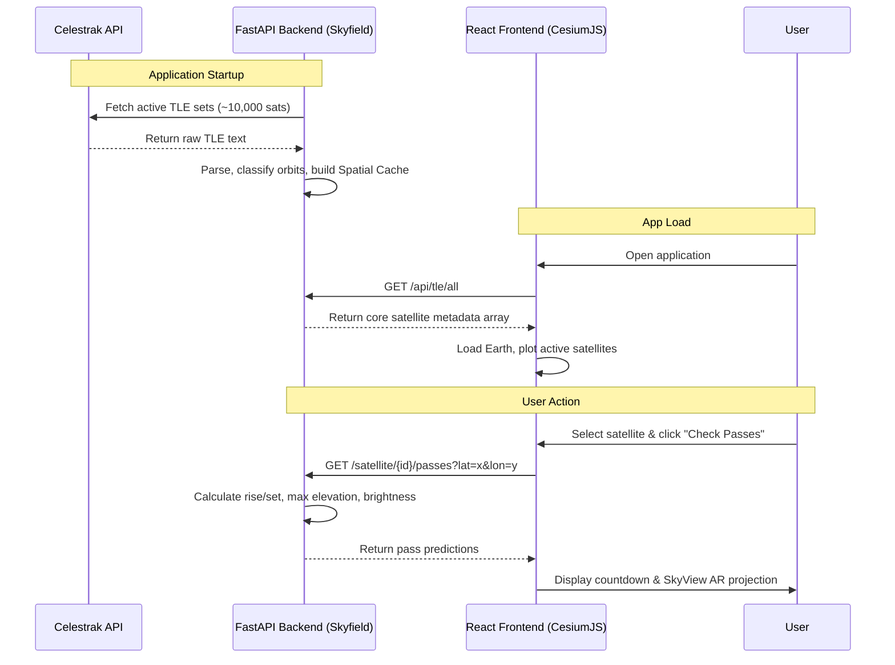

<div align="center">
  
  <h1>🛰️ Satellite Tracker</h1>
  <p><strong>Real-Time Orbital Visualization & Satellite Pass Prediction Platform</strong></p>
  
  [](https://opensource.org/licenses/MIT)
  [](#)
  [](#)
  [](#)
  [](#)

</div>

An interactive real-time satellite tracking and orbital visualization platform that allows users to explore satellites orbiting Earth, predict visible satellite passes, and simulate satellite movement relative to an observer's location.

The project combines orbital mechanics, geospatial visualization, and observer-based sky simulation to create a mission-control style interface for understanding satellite motion.

🌍 **Live Demo:** [Add URL after deployment](https://your-live-demo-url.com)

---

## 🎯 Why This Project Was Built

Modern satellite trackers either:
- show static satellite maps, **or**
- provide pass prediction without visualization.

This project was built to bridge the gap between abstract orbital mechanics and visual understanding.
The goal was to create a system where users can:
- 👀 **See satellites** orbiting Earth in real time
- 🔭 **Predict** when satellites will be visible
- 🌌 **Understand exactly where to look** in the night sky
- 🚀 **Explore** satellite constellations and missions

It also demonstrates practical applications of orbital propagation, space situational awareness (SSA), interactive geospatial 3D visualization, and real-world astronomy tools.

---

## 🚀 Key Features

### 🌎 1. Real-Time Satellite Globe
Interactive 3D Earth visualization showing thousands of satellites in orbit.
* **Real-time motion** calculated via SGP4 propagation.
* **Orbit classification colors (LEO, MEO, GEO)**.
* Interactive camera tracking, search, and metadata highlighting.

### 🔎 2. Deep Satellite Search & Metadata
Search by name, NORAD ID, or mission type. Detailed info includes:
* Orbit classification & Mission category (e.g., Earth Observation, Communications).
* Current latitude, longitude, altitude, and velocity.
* Country of origin & local time at satellite position.

### 🛰 3. Orbit Trail Visualization
When a satellite is selected, the system renders its 90-minute orbital trajectory.
* Predicts future path and ground track.
* Visualizes orbital inclination and period over the Earth.

### ⏳ 4. Time Travel Simulation
Simulate satellite positions hours into the future or past.
* Preview upcoming passes dynamically.
* Visualize orbit progression with a built-in time scrubber.

### 📡 5. Advanced Pass Prediction
Predicts when and where satellites will be visible from the user's location.
* Calculates rise time, maximum elevation, set time, and azimuth direction.
* Assigns **visibility conditions** (naked eye, binoculars, telescope).
* Countdown timer for the next active pass.

### 🌌 6. Observer Sky View (AR-Style)
An azimuth/elevation projection showing satellites relative to the observer's local horizon.
* Horizon circle, elevation rings, and cardinal directions.
* Animated satellite pass arc mapping exactly where the satellite will cross the sky.

### 🔒 7. Secure & Rate Limited
Built for production deployments:
* In-memory sliding window rate-limiter on heavy endpoints to prevent abuse.
* Strict input validation for geographical coordinates and NORAD IDs.
* Secure API headers and sanitized UI rendering.

---

## ⚙️ System Architecture

The system uses a decoupled client-server architecture. The frontend handles 3D rendering and UI state, while the backend leverages Python's `skyfield` library to perform heavy orbital mechanics calculations from Celestrak TLE sets.

> **Note:** The diagrams below use Mermaid syntax. They will automatically render as visual architecture diagrams once pushed to GitHub.



---

## 🛰 Satellite Data Flow



---

## 🧱 Tech Stack

### Frontend
* **React** + **Vite** — Fast UI rendering.
* **CesiumJS** — High-performance interactive 3D globe and geospatial visualization.
* **HTML Canvas** — Custom 2D rendering for the local Observer Sky View.
* **Vanilla CSS** — Custom styling, glassmorphism, responsive design.

### Backend
* **FastAPI** — High-performance asynchronous REST API.
* **Skyfield** — Professional-grade astronomy library for Python (SGP4 propagation).
* **Python-dotenv** — Environment configuration.

### Data Sources
* **Celestrak** — Up-to-date NORAD Two-Line Element (TLE) datasets.

---

## 🌐 Local Development

### 1. Clone the repository
```bash
git clone https://github.com/yourusername/satellite-tracker.git
cd satellite-tracker
```

### 2. Backend Setup
The backend calculates orbital paths and requires a Python virtual environment.
```bash
cd backend

# Create and activate virtual environment
python -m venv venv
# On Windows:
.\venv\Scripts\activate
# On Mac/Linux:
source venv/bin/activate

# Install dependencies
pip install -r requirements.txt

# Create .env file for configuration
cp .env.example .env

# Run the server
uvicorn app.main:app --reload --port 8000
```
Backend API will be available at: `http://localhost:8000`

### 3. Frontend Setup
```bash
cd frontend

# Install dependencies
npm install

# Create environment file
# Be sure to set VITE_API_BASE to http://localhost:8000 if needed
cp .env.example .env.local

# Run the dev server
npm run dev
```
Frontend will be available at: `http://localhost:5173`

---

## 🚀 Deployment

When deploying to any production hosting service, you **must** configure the following environment variables for the frontend and backend to communicate securely:

1. **Backend Environment:** Set `ALLOWED_ORIGINS` to exactly match your public frontend URL (e.g., `https://my-satellite-app.com`). This ensures the strict CORS policy allows your frontend to fetch data.
2. **Frontend Environment:** Set `VITE_API_BASE` to your public backend API URL so React knows where to send requests.
3. **Backend Hardware:** Ensure your backend host provides at least ~256MB of RAM to hold the 10,000+ Skyfield satellite objects in memory.

---

## ⭐ What Makes This Project Stand Out

Most satellite trackers provide only static dots on a map. This project uniquely combines:

1. **Real-Time Orbital Propagation:** Satellite motion computed from real orbital mathematical elements (SGP4), not just interpolated paths.
2. **Dual Visualization Modes:** A global Earth perspective combined with a local sky perspective.
3. **Real Observation Guidance:** Users can see exactly *when* satellites will pass and *where* to look in the sky (Azimuth / Elevation compass).
4. **Interactive Simulation:** Time travel scrubbing allows immediate observation of future orbit states.
5. **Secure & Optimized:** Native API rate limiting and GZip compression to handle massive orbital datasets without crushing the server or the browser.

---

## 📚 Learning Outcomes

Building this platform demonstrated deep knowledge in:
- **Orbital Mechanics:** TLE parsing, Julian dates, Reference frames (ECI, Geodetic, Topocentric).
- **Space Situational Awareness (SSA):** Categorizing millions of data points into actionable intel.
- **Geospatial Rendering:** Managing thousands of WebGL objects efficiently with `CesiumJS`.
- **Full-Stack Web Architecture:** Decoupling intense physics simulations from frontend rendering logic.

---

## 🛰 Future Improvements

Potential extensions for future iterations:
- [ ] **Star Catalog:** Add realistic night sky stars behind the globe and in Observer View.
- [ ] **Visual Magnitude Estimation:** Deeper calculation of satellite brightness based on solar illumination angle.
- [ ] **Constellation Grouping:** Filter visually by network (e.g., Starlink train tracking).
- [ ] **Push Notifications:** Reminders for visible passes over the user's saved location.

---

## 📜 License
[MIT License](LICENSE)

## 👨‍🚀 Author
Developed by **Hemal Bhatt**
